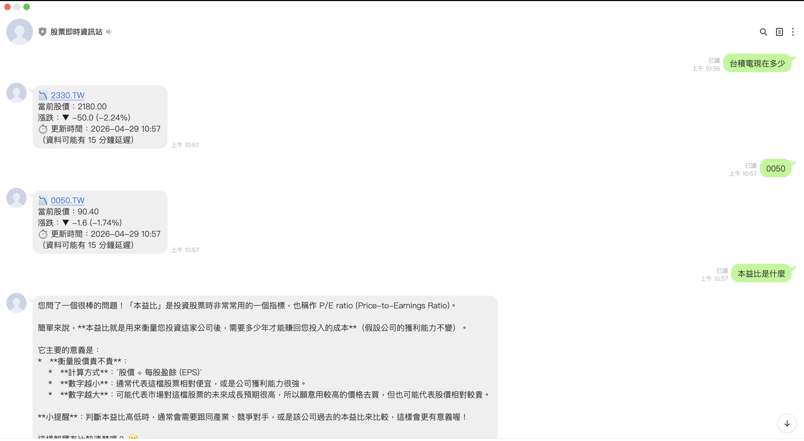

# W11 作業：股票 LINE Bot

> **繳交方式**：將你的 GitHub repo 網址貼到作業繳交區
> **作業性質**：個人作業

---

## 作業目標

利用上週設計的 Skill，開發一個股票相關的 LINE Bot。
重點不是功能多寡，而是你設計的 **Skill 品質**——Skill 寫得越具體，AI 產出的程式碼就越接近可以直接執行。

---

## 功能要求（擇一實作）

| 功能 | 說明 |
| --- | --- |
| AI 分析股票 | 使用者說股票名稱，Gemini 給出分析 |
| 追蹤清單 | 儲存使用者的自選股清單到 SQLite |
| 查詢即時價格 | 整合 yfinance 或 twstock 取得股價 |

> 以「可以執行、能回覆訊息」為目標，不需要複雜

---

## 功能展示

以下是 LINE Bot 實際運作的對話截圖：



**主要功能**：
- ✅ 查詢即時股價
- ✅ Gemini AI 對話（回答股票投資相關問題）
- ✅ SQLite 記錄使用者與互動紀錄

---

## 繳交項目

你的 GitHub repo 需要包含：

| 項目 | 說明 |
| --- | --- |
| `app/` | LINE Webhook + Gemini + SQLite 後端程式碼 |
| `requirements.txt` | 所有套件 |
| `.env.example` | 環境變數範本（不含真實 token） |
| `.agents/skills/` | 至少包含 `/linebot-implement` Skill |
| `README.md` | 本檔案（含心得報告） |
| `screenshots/chat.png` | LINE Bot 對話截圖（至少一輪完整對話） |

### Skill 要求

`.agents/skills/` 至少需要包含：

- `/linebot-implement`：產出 LINE Bot 主程式（必要）
- `/prd` 或 `/architecture`：延用上週的
- `/commit`：延用上週的

---

## 專案結構

```
w10stockBot/
├── .agents/
│   └── skills/
│       ├── prd/SKILL.md
│       ├── linebot-implement/SKILL.md
│       └── commit/SKILL.md
├── app/
│   ├── __init__.py
│   ├── main.py              # FastAPI 應用程式入口
│   ├── webhook.py           # LINE Webhook 路由
│   ├── config.py            # 環境變數設定
│   ├── database.py          # SQLite 資料庫模組
│   ├── memory.py            # 對話記憶管理
│   ├── intent.py            # 意圖識別
│   └── handlers/
│       ├── gemini_handler.py   # Gemini AI 對話
│       └── stock_handler.py    # 股價查詢
├── data/
│   └── bot.db               # SQLite 資料庫檔案
├── docs/
│   └── PRD.md
├── screenshots/
│   └── chat.png
├── requirements.txt
├── .env.example
├── .gitignore
└── README.md
```

> `.env` 和 `data/bot.db` 不要 commit（加入 `.gitignore`）

---

## 啟動方式

```bash
# 1. 建立虛擬環境
python3 -m venv .venv
source .venv/bin/activate   # Windows: .venv\Scripts\activate

# 2. 安裝套件
pip install -r requirements.txt

# 3. 設定環境變數
cp .env.example .env
# 編輯 .env，填入三個 API key：
# - LINE_CHANNEL_SECRET
# - LINE_CHANNEL_ACCESS_TOKEN
# - GEMINI_API_KEY

# 4. 啟動 FastAPI
uvicorn app.main:app --reload --port 8001

# 5. 另開終端機啟動 ngrok
ngrok http 8001
# 複製 ngrok 提供的 https 網址，填入 LINE Developers Console 的 Webhook URL
# 格式：https://xxxx-xxx-xxx-xxx.ngrok-free.app/webhook
# 點「Verify」確認連線正常後，掃 QR Code 加好友開始測試
```

---

## 心得報告

**姓名**：龎靚伊
**學號**：D1245810

**Q1. 你在 `/linebot-implement` Skill 的「注意事項」寫了哪些規則？為什麼這樣寫？**

在 `linebot-dev` Skill 的注意事項中，我特別強調了以下幾點：

1. **SDK 版本要求**：確保 `line-bot-sdk >= 3.0`，所有 import 路徑必須以 `linebot.v3` 開頭
   - 原因：v2 和 v3 的 API 介面差異極大，混用會導致執行錯誤。許多舊教學還在使用 v2，AI 容易產出錯誤的程式碼

2. **非同步處理**：FastAPI handler 和背景任務函式都使用 `async def`
   - 原因：確保程式碼符合 FastAPI 的異步架構，提升效能

3. **Reply Token 一次性限制**：每個事件的 reply_token 只能使用一次，背景任務統一改用 Push Message
   - 原因：這是 LINE Bot 開發中最常見的地雷。Reply token 有 5 分鐘時效且只能用一次，在背景任務中使用會失敗

4. **Webhook 回應時間**：handler 必須在 1 秒內回應 HTTP 200
   - 原因：如果超過 1 秒，LINE 平台會認為請求失敗並重送，導致重複處理同一個訊息

5. **免費額度限制**：LINE Messaging API 免費方案每月 200 則 Push Message，Reply Message 不限
   - 原因：幫助開發者選擇正確的訊息發送方式，避免超出免費額度

這些規則都是基於實際開發中容易踩到的坑，讓 AI 能產出符合生產環境品質的程式碼。

---

**Q2. 你的 Skill 第一次執行後，AI 產出的程式直接能跑嗎？需要修改哪些地方？修改後有沒有更新 Skill？**

第一次執行後發現三個問題：

1. **Webhook 縮排錯誤**：AI 產出的程式碼在處理事件時的縮排不正確，導致邏輯錯誤
   - 修改：調整了 `webhook.py` 中事件處理的程式碼結構

2. **訊息發送方式錯誤**：初版使用了 Push Message，但對於即時回覆的場景應該使用 Reply Message
   - 修改：改用 Reply Message API（免費且無配額限制），背景任務才用 Push Message
   - 原因：Reply Message 不計入免費額度的 200 則限制，更適合一般對話場景

3. **google-genai SDK 版本過舊**：requirements.txt 中的版本與最新 API 不相容
   - 修改：升級到 `google-genai >= 0.5.0`，並調整 `gemini_handler.py` 的 API 呼叫方式

**有沒有更新 Skill？**
有。在發現這些問題後，我在 Skill 的「常見地雷」章節中強化了 Reply vs Push Message 的選擇原則說明，並在標準範例中明確標註何時該用哪種方式，避免 AI 再次產出錯誤的選擇。同時也補充了 SDK 升級後的正確 import 路徑範例。

---

**Q3. 你遇到什麼問題是 AI 沒辦法自己解決、需要你介入處理的？**

主要發現 Skill 在以下方面設計不夠完整：

1. **缺少資料庫整合的指引**：Skill 只寫了如何使用 LINE SDK，但沒有說明何時該記錄資料、記錄哪些欄位。導致 AI 產出的程式碼雖然有 database.py，但 webhook.py 中完全沒有呼叫它。我需要手動判斷「在收到訊息時記錄」、「在加入好友時記錄」等業務邏輯。

2. **Skill 無法涵蓋外部設定**：Skill 再詳細也無法教 AI 如何操作 LINE Developers Console、如何設定 ngrok。這些需要人工操作的步驟，Skill 應該明確列出「需要開發者手動完成的事項清單」，而不是讓 AI 嘗試去做。

3. **測試與驗證的盲區**：Skill 只教 AI「怎麼寫」，沒有教「怎麼驗證寫對了」。AI 無法實際在 LINE App 中測試，也看不到 Webhook 傳送日誌。這導致 AI 產出的程式碼可能有邏輯錯誤（如 Reply Token 在背景任務中失效），但 AI 自己無法發現。


---

**Q4. 如果你要把這個 LINE Bot 讓朋友使用，你還需要做什麼？**

從 Skill 設計的角度來看，需要補充以下內容：

1. **新增「部署」Skill**：目前的 linebot-dev Skill 只教本地開發，沒有涵蓋雲端部署。應該新增一個 Skill 教 AI 如何產出 Render/Railway 的設定檔、如何從 SQLite 切換到 PostgreSQL、如何設定環境變數。

2. **新增「監控與錯誤處理」章節**：Skill 應該教 AI 主動加入錯誤監控（Sentry）、日誌系統、健康檢查端點。目前 AI 只會寫「基本能動」的程式碼，不會考慮「上線後怎麼維護」。

3. **補充「使用者體驗」指引**：Skill 應該包含「友善錯誤訊息」、「使用說明指令」、「Rich Menu 設計」等標準做法。讓 AI 不只寫出「能跑的程式碼」，而是「好用的產品」。

4. **加入「成本評估」提醒**：Skill 應該教 AI 在程式碼中加入用量監控，並在接近免費額度時主動警告。目前 Skill 只提到「LINE 免費方案每月 200 則 Push Message」，但沒有教 AI 如何追蹤和控制用量。

這些都是「讓產品從能動到好用」的關鍵，但目前的 Skill 設計只聚焦在「開發階段」，缺少「上線階段」的考量。